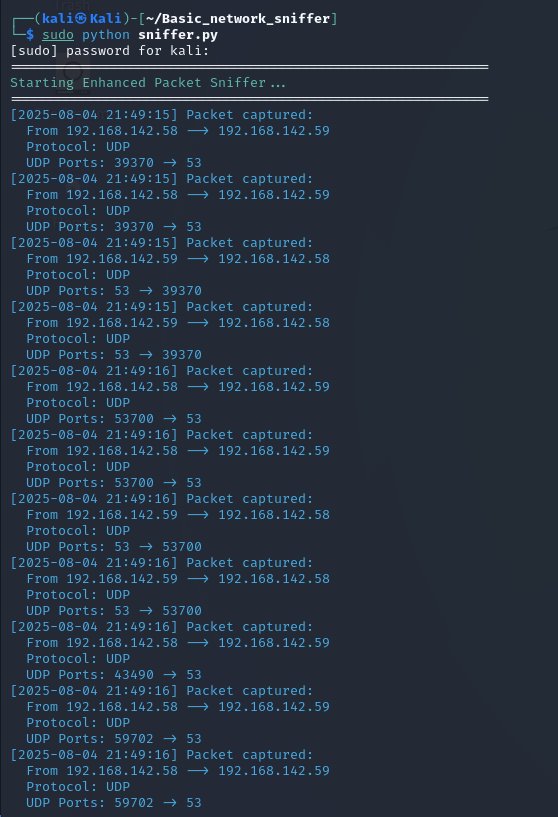

# 🛠️ Enhanced Network Packet Sniffer in Python

## 🔎 Description

This Python program is a **real-time network packet sniffer and analyzer** built with the `scapy` library. It captures and processes network packets directly from your system’s interface and extracts meaningful information such as:

- Source & Destination IPs
- Protocol Type (TCP, UDP, ICMP, etc.)
- Port Numbers
- Payload Data

The program is designed for learning and monitoring purposes and provides insight into how internet protocols work at the packet level.

---

## ✨ Features

- ✅ Live packet capturing using `scapy.sniff()`
- 🌐 Protocol awareness: supports IP, TCP, UDP, and ICMP
- 📍 Source/Destination IP and Port extraction
- 🧾 Payload decoding and safe truncation
- 📝 Logging to `packet_log.txt` for offline review
- 🎨 Clean console output (with optional color using `colorama`)
- 🛡️ Graceful error handling and keyboard interruption

---

## 📚 Educational Value

This tool is perfect for:

- Networking and cybersecurity students
- Anyone learning about packet structures and protocols
- Observing how clients and servers communicate in real-time
- Examining plaintext protocol traffic (e.g., HTTP requests)

---

## 🧪 Example Output

Here's a screenshot of the packet sniffer in action:

